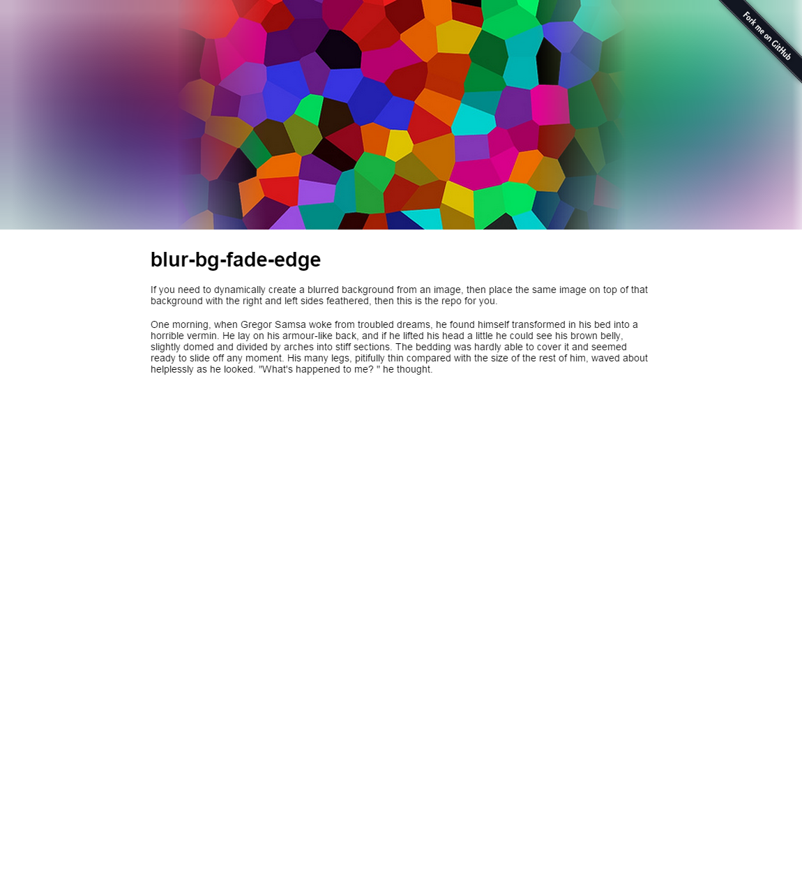

# blur-bg-fade-edge

<h2>DEMO: https://simsketch.github.io/demos/blur-bg-fade-edge/index.html</h2>

If you need to dynamically create a blurred background from an image, then place the same image on top of that background with the right and left sides feathered, then this is the repo for you.

Note: The blurred background should work cross-browser, going back to IE 9 (because I'm using canvas in lieu of CSS3 properties), but the svg edge-blurring mask will only show up in webkit browsers.

